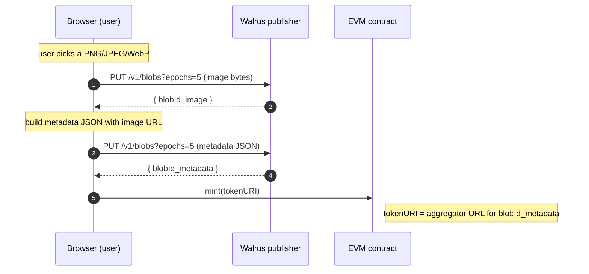
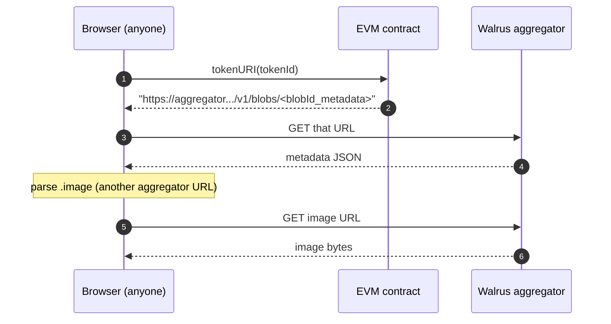

<p align="center">
  <strong>EvmWal NFT</strong> · a 200-line dApp that shows how easy it is to use<br>
  <a href="https://docs.wal.app/">Walrus</a> as a decentralized storage layer behind an EVM smart contract.
</p>

---

The Solidity contract is a vanilla OpenZeppelin **ERC-721 + `ERC721URIStorage`** that knows nothing about Walrus or Sui — it stores a plain `tokenURI` string per token, exactly the way an IPFS-backed NFT would. **All Walrus interaction is HTTP, in the browser.** Two `PUT`s upload the image and metadata; one `GET` reads them back. There is no Walrus SDK, no Sui keypair, no auth token, no signup, no required server.

The result: a normal Next.js + wagmi dApp where anyone with an injected wallet can mint an NFT whose image and metadata live on Walrus testnet, and where every card links back to [Walruscan](https://walruscan.com/testnet) so users can verify their own blobs.

## How the Walrus integration works





Two key takeaways:

- The contract is just an ERC-721 with `_setTokenURI`. To switch an existing IPFS-backed NFT to Walrus, you change **the URL prefix your frontend uploads to** and **the URL prefix it reads from**. That's it.
- Walrus testnet's public publisher is **unauthenticated and free** — it pays the WAL storage cost on your behalf. The 5-epoch (≈ 14-day) retention is enforced via the `?epochs=5` query string on the upload.

## The integration in one fetch

The entire write side, with no SDK:

```ts
// Upload a file to Walrus from the browser.
const res = await fetch(
  "https://publisher.walrus-testnet.walrus.space/v1/blobs?epochs=5",
  { method: "PUT", headers: { "Content-Type": file.type }, body: file },
);
const json = await res.json();
const blobId =
  json.newlyCreated?.blobObject?.blobId ??
  json.alreadyCertified?.blobId;

// Read it back from anywhere.
const url = `https://aggregator.walrus-testnet.walrus.space/v1/blobs/${blobId}`;
```

The full helper this dApp uses is [`web/lib/walrus-upload.ts`](./web/lib/walrus-upload.ts) — fewer than 50 lines, including TypeScript types and error handling.

## How it compares to IPFS

| | IPFS | Walrus testnet (as used here) |
|---|---|---|
| Cost model | pay a pinning service indefinitely, or run your own pinner | publisher pays WAL upfront for N epochs |
| Public free entry point | gateway availability varies; pinners may drop | first-party public publisher, no signup |
| EVM integration shape | store CID string in `tokenURI` | store aggregator URL string in `tokenURI` |
| Migration effort | — | swap two URL prefixes in the frontend |
| Required Sui knowledge | n/a | none (HTTP only) |

The Solidity side is identical. The frontend swap is a few lines.

## See it work locally

```bash
git clone git@github.com:MystenLabs/evm-nft-wal.git && cd evm-nft-wal
pnpm install
```

Then in two terminals:

```bash
# Terminal A
pnpm dev:chain        # starts anvil on 127.0.0.1:8545

# Terminal B
pnpm deploy:local     # deploys EvmWalNFT to anvil
pnpm extract-abi      # syncs address + ABI into the web app
pnpm dev:web          # http://localhost:3000
```

Open <http://localhost:3000>, connect MetaMask, switch to the **Anvil** network (chain id `31337`, RPC `http://127.0.0.1:8545`), and use the **Mint** tab. Your NFT appears in **All NFTs** and **My NFTs** within seconds of the on-chain confirmation; clicking any card opens the underlying blob on Walruscan.

<details>
<summary>Prerequisites</summary>

- macOS / Linux (tested on darwin-arm64)
- **Node 22** — `.nvmrc` pins this (`nvm use` if you have nvm)
- **pnpm 10** — `corepack enable && corepack prepare pnpm@10.32.1 --activate`
- **Foundry** — `curl -L https://foundry.paradigm.xyz | bash && foundryup`
- An injected EVM wallet (MetaMask, Rabby, Coinbase Wallet extension, …). No real ETH needed; the deploy script funds itself from Anvil dev-0.

The Walrus side requires **nothing**: no Sui wallet, no WAL tokens, no CLI, no account. Just outbound HTTPS to `*.walrus-testnet.walrus.space`.
</details>

<details>
<summary>Funding a wallet other than Anvil dev-0</summary>

```bash
cast send <your-wallet-address> --value 100ether \
  --rpc-url http://127.0.0.1:8545 \
  --private-key 0xac0974bec39a17e36ba4a6b4d238ff944bacb478cbed5efcae784d7bf4f2ff80
```

That's the well-known Anvil dev-0 private key. Safe for local dev, never for a real chain.
</details>

## Stack

| | |
|---|---|
| Contracts | Foundry · Solidity ^0.8.24 · OpenZeppelin Contracts v5.1.0 (`ERC721` + `ERC721URIStorage` + `Ownable`) |
| Frontend | Next.js 16 (App Router) · React 19 · Tailwind v4 · TypeScript |
| EVM client | viem · wagmi · RainbowKit · @tanstack/react-query |
| Off-chain storage | Walrus testnet — publisher + aggregator over HTTP |
| Package manager | pnpm 10 (workspace: `contracts`, `web`) |
| Local chain | Anvil — chain id 31337 |

## Contract surface

```solidity
function mint(string memory tokenURI_) external returns (uint256 tokenId);
function mintTo(address to, string memory tokenURI_) external returns (uint256 tokenId);
event Minted(uint256 indexed tokenId, address indexed minter, string tokenURI_);
```

`mint` is public — anyone can self-mint. `mintTo` is the gift-mint variant. `Ownable` is still inherited but no longer gates minting (reserved for future admin needs).

## Repo shape

```
evm-nft-wal/
├── contracts/                 Foundry package
│   ├── src/EvmWalNFT.sol        open mint + mintTo + Minted event
│   ├── test/EvmWalNFT.t.sol     7 tests · 100% line coverage on the contract
│   └── script/Deploy.s.sol      deploy-only
├── scripts/
│   ├── write-deployed-address.ts
│   ├── extract-abi.ts           writes web/.env.local + web/lib/contract.ts
│   ├── generate-assets.ts       legacy dev fixture generator
│   └── upload-walrus.ts         DEPRECATED — Node reference for the publisher PUT shape
├── web/                       Next.js 16 App Router
│   ├── app/
│   │   ├── page.tsx             tabs: All / Mine / Mint
│   │   └── providers.tsx        wagmi + RainbowKit (no WalletConnect, no Coinbase Wallet)
│   ├── components/
│   │   ├── AllNFTsView.tsx · MyNFTsView.tsx · MintForm.tsx
│   │   ├── NFTCard.tsx          image · metadata · Walruscan links · on-chain details expander
│   │   ├── Tabs.tsx · ConnectButton.tsx
│   ├── hooks/
│   │   ├── useMint.ts           multi-stage state machine
│   │   └── useAllTokens.ts      totalSupply scan + ownerOf fan-out
│   └── lib/
│       ├── walrus-upload.ts     browser-side publisher PUT
│       ├── walruscan.ts         Walruscan URL + parser helpers
│       ├── walrus.ts            aggregator URL helper
│       ├── metadata.ts          ERC-721 metadata schema builder
│       ├── chains.ts            Anvil 31337 only
│       └── contract.ts          ABI + address (overwritten by extract-abi)
└── tests/                     node:test harness used during the build
```

## Scripts

| Command | What it does |
|---|---|
| `pnpm dev:chain` | Start Anvil on 127.0.0.1:8545 |
| `pnpm deploy:local` | Deploy `EvmWalNFT` to Anvil; write `.deployed-address` |
| `pnpm extract-abi` | Populate `web/.env.local` + `web/lib/contract.ts` from forge output |
| `pnpm dev:web` | Start Next.js dev server on `:3000` |
| `pnpm gen:assets` | Re-generate the 5 sample PNGs (legacy dev utility) |
| `pnpm seed:walrus` | DEPRECATED — legacy utility; not used at runtime |
| `pnpm lint` | Lint TS/TSX |
| `pnpm format` | Prettier (+ `prettier-plugin-solidity` for `.sol`) |

## Tests

- `cd contracts && forge test -vv` — 7 unit tests, 100% line coverage on `src/EvmWalNFT.sol`.
- `tests/v2-cycle{1..7}/*.test.mjs` — Node `node:test` suites used during the build.

## Notes

- If a Walrus upload succeeds but the on-chain mint never lands (user rejects the wallet prompt, tx reverts), the uploaded blobs become orphaned on the testnet — harmless, you spent nothing.
- The gallery scans `1..totalSupply` on every render. Snappy below ~100 tokens; for real scale you'd want a subgraph or `Transfer` event indexer.
- The public Walrus testnet publisher has a ~10 MiB blob cap; this app caps uploads at 5 MiB to leave headroom.

## License

[MIT](./LICENSE). The Solidity sources carry `SPDX-License-Identifier: MIT` per Foundry/OpenZeppelin convention.
