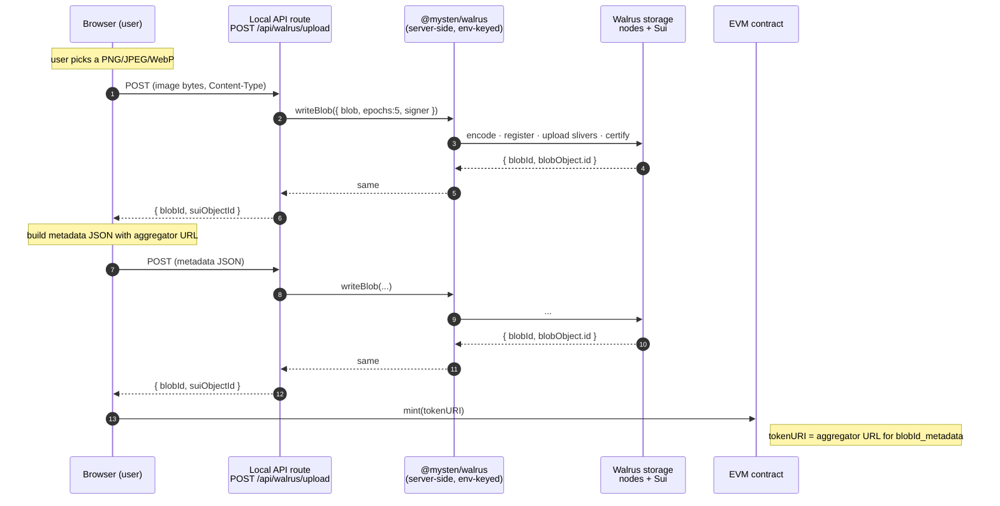
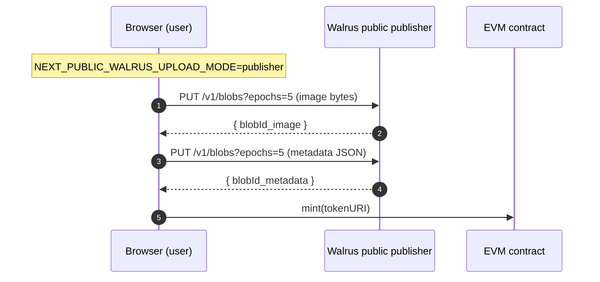
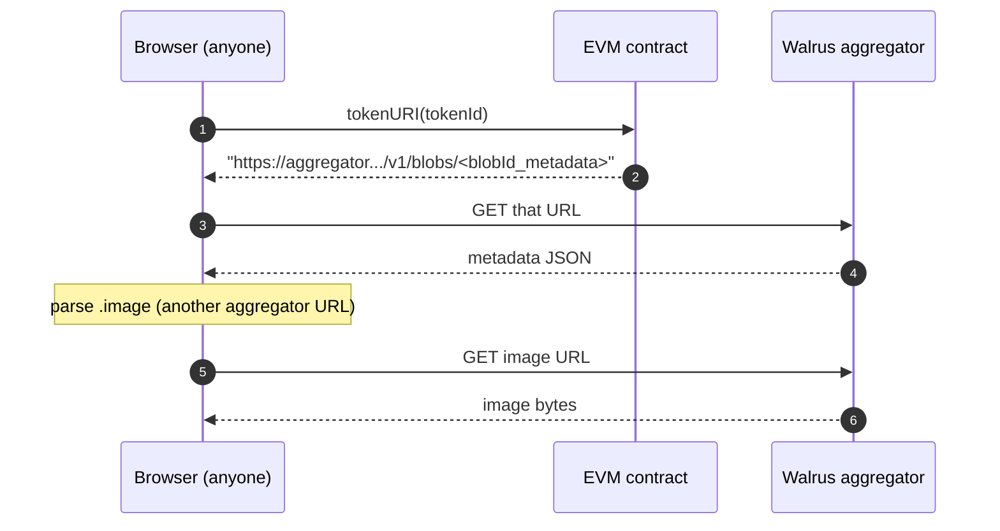

<p align="center">
  <strong>EvmWal NFT</strong> · a 200-line dApp that shows how easy it is to use<br>
  <a href="https://docs.wal.app/">Walrus</a> as a decentralized storage layer behind an EVM smart contract.
</p>

---

The Solidity contract is a vanilla OpenZeppelin **ERC-721 + `ERC721URIStorage`** that knows nothing about Walrus or Sui — it stores a plain `tokenURI` string per token, exactly the way an IPFS-backed NFT would.

The dApp ships **two write paths** and one shared read path. Both write paths drop the same kind of string into the same contract; the EVM side never knows the difference.

- **`backend` mode** (default) — the browser POSTs the image bytes to a minimal local Next.js API route at `/api/walrus/upload`. The route uses [`@mysten/walrus`](https://docs.wal.app/dev-blog/2024/03/19/walrus-typescript-sdk.html) with a Sui keypair loaded from env to register, upload, and certify the blob on Sui. The **operator** pays WAL and **owns the on-Sui `Blob` object**. The route is unauthenticated — local development only.
- **`publisher` mode** (opt-in via `NEXT_PUBLIC_WALRUS_UPLOAD_MODE=publisher`) — the browser does one `PUT` to Walrus testnet's [public publisher](https://docs.wal.app/usage/web-api.html). No SDK, no Sui keypair, no server-side env. The publisher pays WAL on the operator's behalf.

The **read path is identical** in both modes: an anonymous `GET` against the Walrus aggregator. No proxy, no auth.

The result: a normal Next.js + wagmi dApp where anyone with an injected EVM wallet can mint an NFT whose image and metadata live on Walrus testnet, and where every card links back to [Walruscan](https://walruscan.com/testnet) so users can verify their own blobs.

## How the Walrus integration works

### Write — default (`backend` mode)



### Write — fallback (`publisher` mode)



### Read — both modes



Three key takeaways:

- The contract is just an ERC-721 with `_setTokenURI`. To switch an existing IPFS-backed NFT to Walrus, you change **what your frontend uploads to** and **what URL prefix it reads from**. That's it.
- Both write paths end in the same `blobId` and the same aggregator URL. The EVM contract sees no difference; consumers reading `tokenURI` see no difference.
- The 5-epoch (≈ 14-day) retention is identical in both modes — it's the `epochs=5` query string in publisher mode, and the `epochs: 5` SDK parameter in backend mode.

## The integration in one fetch

From the browser, the write side is one POST regardless of mode:

```ts
// Backend mode (default) — server-side SDK pays WAL with the operator's wallet.
const res = await fetch("/api/walrus/upload", {
  method: "POST",
  headers: { "Content-Type": file.type },
  body: file,
});
const { blobId, suiObjectId } = await res.json();

// Read it back from anywhere — same aggregator GET in either mode.
const url = `https://aggregator.walrus-testnet.walrus.space/v1/blobs/${blobId}`;
```

Switching to publisher mode is a one-line env override and one different URL — see [`web/lib/walrus-upload.ts`](./web/lib/walrus-upload.ts) (PUT to the public publisher) versus [`web/lib/walrus-upload-backend.ts`](./web/lib/walrus-upload-backend.ts) (POST to the local route). The dispatcher in [`web/hooks/useMint.ts`](./web/hooks/useMint.ts) picks one at module load based on `NEXT_PUBLIC_WALRUS_UPLOAD_MODE`. The server-side handler is [`web/app/api/walrus/upload/handler.ts`](./web/app/api/walrus/upload/handler.ts) — about 30 lines, dependency-injected so it tests cleanly without hitting the live SDK.

## How it compares to IPFS

| | IPFS | Walrus — operator backend (default) | Walrus — public publisher |
|---|---|---|---|
| Cost model | pay a pinning service indefinitely, or run your own pinner | operator pays WAL upfront for N epochs from their own Sui wallet | first-party public publisher pays WAL on the user's behalf |
| Shipping infra | pinner host or service contract | one tiny Next.js route + a funded Sui keypair | nothing — HTTPS only |
| Apples-to-apples analogue | — | "run your own pinner" | "pin via a free third-party gateway" |
| EVM integration shape | store CID string in `tokenURI` | store aggregator URL string in `tokenURI` | store aggregator URL string in `tokenURI` |
| Migration effort | — | wire up `web/app/api/walrus/upload` once, then the frontend changes one URL prefix | swap two URL prefixes in the frontend |
| Required Sui knowledge | n/a | hold and fund a Sui keypair; understand `epochs` | none (HTTP only) |
| On-Sui `Blob` object | n/a | operator owns it — can extend / delete on-chain | publisher owns it — opaque to the dApp |

The Solidity side is identical across all three columns.

## Local-only operator mode

> ⚠️ **The backend upload route at `/api/walrus/upload` is unauthenticated.** It signs Sui transactions with the keypair from `SUI_PRIVATE_KEY` and spends the operator's WAL on every successful request — no shared secret, no rate limit. **Run it only on a local dev server with a testnet keypair you control.** Do not deploy this route to a public host.

To run the default `backend` upload path you need:

1. **A Sui testnet keypair.** Generate or export one with [`sui client`](https://docs.sui.io/references/cli/client) and grab the bech32 form (starts with `suiprivkey`). You can also export an existing wallet from Slush / Suiet.
2. **Testnet SUI** for gas — request from the [Sui testnet faucet](https://faucet.sui.io/).
3. **Testnet WAL** for storage payments — follow the Walrus docs for the [testnet WAL faucet](https://docs.wal.app/usage/setup.html#testnet-wal-from-the-faucet).
4. **A `web/.env.local` file.** Copy [`web/.env.local.example`](./web/.env.local.example) and fill in `SUI_PRIVATE_KEY` plus the `NEXT_PUBLIC_CONTRACT_ADDRESS` from `.deployed-address`.

To skip Sui-side setup entirely and use the public publisher instead, set `NEXT_PUBLIC_WALRUS_UPLOAD_MODE=publisher` in `web/.env.local`. The browser then PUTs directly to Walrus's public publisher and the EVM mint still works — no keypair, no faucet, no API route.

## See it work locally

```bash
git clone git@github.com:MystenLabs/evm-nft-wal.git && cd evm-nft-wal
pnpm install
cp web/.env.local.example web/.env.local
# ...then edit web/.env.local with your SUI_PRIVATE_KEY (backend mode)
# ...or set NEXT_PUBLIC_WALRUS_UPLOAD_MODE=publisher and skip the Sui side
```

Then in two terminals:

```bash
# Terminal A
pnpm dev:chain        # starts anvil on 127.0.0.1:8545

# Terminal B
pnpm deploy:local     # deploys EvmWalNFT to anvil
pnpm extract-abi      # syncs address + ABI into the web app
pnpm dev:web          # http://localhost:3000
```

Open <http://localhost:3000>, connect MetaMask, switch to the **Anvil** network (chain id `31337`, RPC `http://127.0.0.1:8545`), and use the **Mint** tab. Your NFT appears in **All NFTs** and **My NFTs** within seconds of the on-chain confirmation; clicking any card opens the underlying blob on Walruscan, and in backend mode the post-mint success panel links the on-Sui `Blob` objects on Suiscan.

<details>
<summary>Prerequisites</summary>

- macOS / Linux (tested on darwin-arm64)
- **Node 22** — `.nvmrc` pins this (`nvm use` if you have nvm)
- **pnpm 10** — `corepack enable && corepack prepare pnpm@10.32.1 --activate`
- **Foundry** — `curl -L https://foundry.paradigm.xyz | bash && foundryup`
- An injected EVM wallet (MetaMask, Rabby, Coinbase Wallet extension, …). No real ETH needed; the deploy script funds itself from Anvil dev-0.
- For the default `backend` upload mode: a testnet Sui keypair, plus testnet SUI and WAL (see [Local-only operator mode](#local-only-operator-mode)).
- For `publisher` mode: nothing on the Sui side — just outbound HTTPS to `*.walrus-testnet.walrus.space`.
</details>

<details>
<summary>Funding a wallet other than Anvil dev-0</summary>

```bash
cast send <your-wallet-address> --value 100ether \
  --rpc-url http://127.0.0.1:8545 \
  --private-key 0xac0974bec39a17e36ba4a6b4d238ff944bacb478cbed5efcae784d7bf4f2ff80
```

That's the well-known Anvil dev-0 private key. Safe for local dev, never for a real chain.
</details>

## Stack

| | |
|---|---|
| Contracts | Foundry · Solidity ^0.8.24 · OpenZeppelin Contracts v5.1.0 (`ERC721` + `ERC721URIStorage` + `Ownable`) |
| Frontend | Next.js 16 (App Router) · React 19 · Tailwind v4 · TypeScript |
| EVM client | viem · wagmi · RainbowKit · @tanstack/react-query |
| Off-chain storage | Walrus testnet — `@mysten/walrus` 1.x in the API route (default) OR public publisher PUT (fallback); aggregator GET in both modes |
| Package manager | pnpm 10 (workspace: `contracts`, `web`) |
| Local chain | Anvil — chain id 31337 |

## Contract surface

```solidity
function mint(string memory tokenURI_) external returns (uint256 tokenId);
function mintTo(address to, string memory tokenURI_) external returns (uint256 tokenId);
event Minted(uint256 indexed tokenId, address indexed minter, string tokenURI_);
```

`mint` is public — anyone can self-mint. `mintTo` is the gift-mint variant. `Ownable` is still inherited but no longer gates minting (reserved for future admin needs).

## Repo shape

```
evm-nft-wal/
├── contracts/                 Foundry package
│   ├── src/EvmWalNFT.sol        open mint + mintTo + Minted event
│   ├── test/EvmWalNFT.t.sol     7 tests · 100% line coverage on the contract
│   └── script/Deploy.s.sol      deploy-only
├── scripts/
│   ├── write-deployed-address.ts
│   ├── extract-abi.ts           writes web/.env.local + web/lib/contract.ts
│   ├── generate-assets.ts       legacy dev fixture generator
│   └── upload-walrus.ts         DEPRECATED — Node reference for the publisher PUT shape
├── web/                       Next.js 16 App Router
│   ├── app/
│   │   ├── page.tsx             tabs: All / Mine / Mint
│   │   ├── providers.tsx        wagmi + RainbowKit (no WalletConnect, no Coinbase Wallet)
│   │   └── api/walrus/upload/
│   │       ├── route.ts         POST handler (local-only, env-keyed wallet)
│   │       └── handler.ts       pure dep-injected SDK call — testable in isolation
│   ├── components/
│   │   ├── AllNFTsView.tsx · MyNFTsView.tsx · MintForm.tsx
│   │   ├── NFTCard.tsx          image · metadata · Walruscan links · on-chain details expander
│   │   ├── Tabs.tsx · ConnectButton.tsx
│   ├── hooks/
│   │   ├── useMint.ts           multi-stage state machine; dispatches publisher vs backend
│   │   └── useAllTokens.ts      totalSupply scan + ownerOf fan-out
│   └── lib/
│       ├── walrus-upload.ts          browser-side publisher PUT (fallback path)
│       ├── walrus-upload-backend.ts  browser-side POST to /api/walrus/upload (default path)
│       ├── walrus-server-env.ts      server-only Sui keypair + WalrusClient loader
│       ├── walruscan.ts              Walruscan URL + parser helpers
│       ├── suiscan.ts                Suiscan object URL helper
│       ├── walrus.ts                 aggregator URL helper
│       ├── metadata.ts               ERC-721 metadata schema builder
│       ├── chains.ts                 Anvil 31337 only
│       └── contract.ts               ABI + address (overwritten by extract-abi)
└── tests/                     node:test harness used during the build
```

## Scripts

| Command | What it does |
|---|---|
| `pnpm dev:chain` | Start Anvil on 127.0.0.1:8545 |
| `pnpm deploy:local` | Deploy `EvmWalNFT` to Anvil; write `.deployed-address` |
| `pnpm extract-abi` | Populate `web/.env.local` + `web/lib/contract.ts` from forge output |
| `pnpm dev:web` | Start Next.js dev server on `:3000` |
| `pnpm gen:assets` | Re-generate the 5 sample PNGs (legacy dev utility) |
| `pnpm seed:walrus` | DEPRECATED — legacy utility; not used at runtime |
| `pnpm lint` | Lint TS/TSX |
| `pnpm format` | Prettier (+ `prettier-plugin-solidity` for `.sol`) |

## Tests

- `cd contracts && forge test -vv` — 7 unit tests, 100% line coverage on `src/EvmWalNFT.sol`.
- `tests/v2-cycle{1..7}/*.test.mjs` — Node `node:test` suites used during the build.

## Notes

- If a Walrus upload succeeds but the on-chain mint never lands (user rejects the wallet prompt, tx reverts), the uploaded blobs become orphaned on the testnet. In `publisher` mode that's harmless — you spent nothing. In `backend` mode the operator did pay WAL, but the blob is still readable forever (for its remaining epoch retention), so it's not wasted, just unreferenced from chain.
- The gallery scans `1..totalSupply` on every render. Snappy below ~100 tokens; for real scale you'd want a subgraph or `Transfer` event indexer.
- The public Walrus testnet publisher has a ~10 MiB blob cap; this app caps client-side uploads at 5 MiB and server-side at 15 MiB to leave headroom.
- `@mysten/walrus` ships its WASM-backed Reed-Solomon encoder for sliver computation, so the API route runs on `runtime = 'nodejs'`. `serverExternalPackages` in [`web/next.config.ts`](./web/next.config.ts) keeps the package out of Turbopack's bundler.

## License

[MIT](./LICENSE). The Solidity sources carry `SPDX-License-Identifier: MIT` per Foundry/OpenZeppelin convention.
