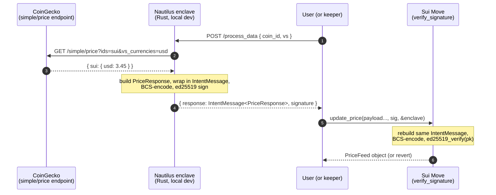

<p align="center">
  <strong>Showcase 07 — Nautilus price oracle (Sui + TEE)</strong> · the path forward when an EVM contract can't verify off-chain computation.
</p>

---

## Why this showcase is different

Showcases 01–06 are all *EVM with a Walrus blob behind it* — the contract stays in Solidity, only the storage layer changes. **Showcase 07 leaves EVM.** Walrus, multi-oracle medians, and content-addressed retrieval all stop helping when the trust failure is **inside the off-chain computation itself**: a leaked API key, a manipulable spot price, an unattested ML inference, a TEE-or-trust-us cross-chain relay. That's the wall.

[Nautilus](https://docs.sui.io/sui-stack/nautilus) is Mysten's TEE + on-chain attestation framework: write the sensitive logic in Rust, run it inside an AWS Nitro Enclave, register the enclave's PCR measurements and ephemeral pubkey on Sui via a Move package, and have the contract cryptographically verify every signed payload. The investigation that motivates this showcase — [`notes/NAUTILUS_EVM.md`](./notes/NAUTILUS_EVM.md) — walks the twelve trust-failure categories where EVM developers keep hitting this wall, mapped to documented incidents (Mango, Ronin, KelpDAO/LayerZero) and the EVM-side workarounds that haven't worked.

This showcase is the **smallest runnable Nautilus app**: a CoinGecko-backed Sui price oracle, vendored from [`MystenLabs/nautilus`](https://github.com/MystenLabs/nautilus), trimmed to one app, and rigged for **free local development** — deterministic signing key, all-zero PCRs, no AWS, no Marlin Oyster — so the full Rust → BCS → ed25519 → Move verify loop closes on a laptop.

> If you're staying on EVM, this showcase is informational. The same TEE *shape* exists for EVM developers via Phala, Marlin Oyster, Oasis Sapphire (confidential EVM), or Flashbots' SGX/TDX stack. The honest contrast is in [`notes/NAUTILUS_EVM.md`](./notes/NAUTILUS_EVM.md) §§ "Where Nautilus wins outright" and "Where Nautilus is not the right choice".

## What's in this folder

```
07-nautilus/
├── enclave/             Rust nautilus-server, single binary
│   ├── Cargo.toml       default = local-dev features
│   └── src/
│       ├── main.rs              deterministic key injection (Step 3)
│       ├── lib.rs               AppState, EnclaveError
│       ├── common.rs            IntentMessage, sign helper, health/attest
│       └── apps/price_oracle/
│           ├── mod.rs           CoinGecko fetch + sign + BCS test
│           └── allowed_endpoints.yaml
├── move/
│   ├── enclave/         generic verifier — vendored verbatim from upstream
│   │   └── sources/enclave.move
│   └── price-oracle/    your app
│       ├── sources/oracle.move
│       └── tests/oracle_tests.move
├── scripts/
│   └── post-price.sh    closes the end-to-end loop (curl + sui client call)
└── notes/
    ├── NAUTILUS_EVM.md          field report — twelve trust-failure categories
    └── NAUTILUS_LOCAL_DEV.md    step-by-step recipe this showcase implements
```

The dApp surface: **one Rust binary + one Move package + one shared payload struct**.

## How signing works



Three properties hold by construction:

- **BCS is positional.** The Rust `PriceResponse` and Move `PricePayload` declare `coin_id, vs, price_micro` in the same order. Reorder either and signature verification silently fails. The `print_payload_bcs` test on both sides exists to catch this before deploy.
- **Intent byte prevents cross-domain replay.** The enclave prepends `PRICE_INTENT = 0`; the Move contract passes the same constant to `verify_signature`. A signature from a future `Twitter` app cannot be replayed against `update_price`.
- **PCR registration gates the pubkey.** `EnclaveConfig::pcrs` pin the enclave image; `register_enclave` extracts the pubkey from the attested NSM document only if the document's PCRs match. In local dev we use all-zero PCRs + a deterministic key — which deliberately breaks the attestation half of the security model, so the BCS+signature half can still be exercised.

## Run it locally (no AWS, no Marlin)

Prerequisites: `rustc` ≥ 1.81, `sui` CLI, `jq`, `python3`. No Docker, no AWS CLI, no `nitro-cli`, no `oyster-cvm`.

```bash
# 1. Compile + run the enclave (local-dev features by default).
cd showcases/07-nautilus/enclave
cargo run
# → prints: ENCLAVE_PUBKEY_HEX=<save this>
# → listens on http://0.0.0.0:3000

# 2. In another terminal, smoke-test it.
curl -fsS -H 'Content-Type: application/json' \
     -d '{"payload":{"coin_id":"sui","vs":"usd"}}' \
     http://localhost:3000/process_data | jq .

# 3. Build + publish the Move packages.
cd ../move/enclave   && sui move build && sui client publish
# → record ENCLAVE_PACKAGE_ID
cd ../price-oracle   && sui move build && sui client publish
# → record APP_PACKAGE_ID, CAP_ID, ENCLAVE_CONFIG_ID

# 4. Register the dev pubkey (all-zero PCRs + ENCLAVE_PUBKEY_HEX).
#    Exact CLI shape depends on your fork of the `enclave` package —
#    see notes/NAUTILUS_LOCAL_DEV.md §8 for the two options.

# 5. Close the loop.
export APP_PACKAGE_ID=0x... ENCLAVE_OBJECT_ID=0x...
./scripts/post-price.sh sui usd
```

If everything lines up — Rust and Move BCS structs match, `ENCLAVE_PUBKEY_HEX` was the one registered — a `PriceFeed` object lands on testnet. View it on [suivision.xyz](https://testnet.suivision.xyz/) using the object id from the transaction output.

## Going to production

The local-dev shortcuts each map to one production step:

| Local-dev | Production |
|---|---|
| `cargo run` with `dev-key` feature | `make ENCLAVE_APP=price-oracle` builds the EIF inside a reproducible container; ephemeral key is random per-boot |
| All-zero PCRs in `init` | `cat out/nitro.pcrs` after the build, pass real PCR0/PCR1/PCR2 into `update_pcrs` (or set them at `create_enclave_config` time) |
| Hand-call `register_enclave_dev` | Standard `register_enclave.sh`, which calls `/get_attestation` on the live Nitro instance and submits the COSE_Sign1 doc |
| `cargo` features `dev-key` (default) | `cargo` features `nitro`; remove `dev-key` |

Two viable paths:

1. **AWS Nitro EC2 directly** — Mysten's `UsingNautilus.md` walks this end-to-end. Watch the EC2 cost (~$0.19/hr for an m5.xlarge with Nitro enabled); stop the instance when not testing.
2. **Marlin Oyster CVM** — Docker-based, pay-per-minute in USDC on Arbitrum, sub-cent for short test deployments. Marlin operators host the Nitro instances.

The Rust app logic and Move contract code carry over **unchanged** — that's the point of having the BCS-compatibility tests pass at green.

## Why this isn't an EVM showcase

This is the only showcase in the repo that doesn't have a Solidity contract. The honest reasons:

1. **An EVM contract can't cheaply verify a Nitro attestation.** Marlin's optimized Solidity verifier hits ~70M gas after two rounds of optimization; even the cheap path (cert-chain once, then per-payload signature verify) is expensive enough that the recommended pattern is *register attestation once, then verify cheap ed25519 signatures forever after*. The Sui Move ed25519 primitive is **one signature check** — that's where the cost asymmetry lives.
2. **The Move-side `EnclaveConfig` + `Enclave` shared objects don't have a clean EVM analog.** You can fake it with an immutable verifier contract + a registry, but the upgrade story (`update_pcrs`, `destroy_old_enclave`) gets ugly fast.
3. **Mysten ships the framework.** First-party Move bindings, BCS round-trip helpers, reproducible-build template, and the [Nautilus-Twitter](https://github.com/MystenLabs/nautilus-twitter) reference frontend are all integrated against Sui. Bridging to EVM would re-introduce a vendor seam this showcase is built to avoid.

If you need TEE-attested signed payloads landing in an EVM contract, look at **Marlin Oyster's Solidity attestation verifier** ([marlinprotocol/sui-oyster-demo](https://github.com/marlinprotocol/sui-oyster-demo) and their Solidity equivalents) — same TEE, same ed25519 signatures, EVM-side verifier doing the gas-expensive cert-chain work.

## Further reading

- [`notes/NAUTILUS_EVM.md`](./notes/NAUTILUS_EVM.md) — full field report: twelve EVM trust-failure categories, what EVM devs are actually saying, where Nautilus wins and where it loses.
- [`notes/NAUTILUS_LOCAL_DEV.md`](./notes/NAUTILUS_LOCAL_DEV.md) — the step-by-step recipe this showcase implements.
- [Nautilus design doc](https://docs.sui.io/sui-stack/nautilus/nautilus-design) — the trust model, in 15 minutes.
- [`MystenLabs/nautilus`](https://github.com/MystenLabs/nautilus) — upstream framework.
- [`MystenLabs/nautilus-twitter`](https://github.com/MystenLabs/nautilus-twitter) — bigger reference: full-stack frontend, on-chain Twitter-attested NFTs.
- [Marlin Oyster](https://docs.marlin.org/oyster/introduction-to-marlin/) — the EVM-reachable TEE alternative.

This is **showcase 07** of [Walrus - EVM Integrations](../../README.md). Walkthrough page: [`docs/07-nautilus.html`](../../docs/07-nautilus.html).
